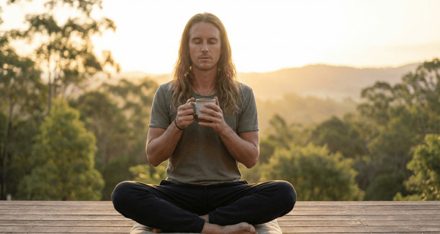
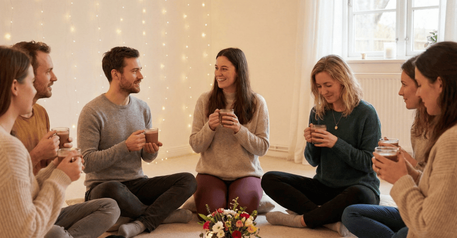

## Why therapy might be helpful for you

Living in a new country can be thrilling, but it can also bring up some tough emotions. You might be feeling:

*   **Culture shock**: it’s normal to feel disoriented as you adjust to a new way of life.
    
*   **Loneliness**: missing your old friends or the familiar things that made you feel at home.
    
*   **Struggling to build a new community** or find a place where you truly belong.
    
*   **Changes in your identity** as you adapt to a new culture and environment.
    
*   **Homesickness**: it’s hard to be far from the people and places you love.
    
*   **The stress of dealing with language barriers** or not fully understanding the local customs.
    
*   **Relationship strain**: whether with your partner or family, living abroad can put pressure on your connections.
    
*   **Anxiety** related to the uncertainty and instability of life abroad.
    

## Recommended therapeutic approaches:

Below is an overview of the therapeutic approaches used in sessions. Your treatment plan is always personalized, these modalities can be used individually or combined depending on your needs - including with the body movement therapy or other therapies.

*   Traditional Psychotherapy
    
    This is a chance for you to open up about what’s been weighing on you... whether it’s adjusting to life in Mexico, missing home, or just feeling uncertain. We’ll talk through your feelings, explore how you’re coping, and work together to build resilience.
    
*   EMDR
    
    If the stress of moving or life changes is overwhelming, EMDR can help you process those emotions. It’s especially helpful when you’re feeling stuck or trapped by your experiences.
    
*   Brainspotting Therapy
    
    This approach goes deep into the emotional side of things, helping you connect with feelings of being out of place or unsure of your sense of belonging here.
    
*   Body Movement & Somatic Work
    
    When you’re adjusting to a new life, your body can feel “on edge.” Through breathing exercises, gentle movement, and yoga-based practices, we’ll help calm your body and ease the tension that comes with living abroad.
    
*   Optional Cacao Session
    
    If you’re going through a big transition or struggling to find your balance, a cacao ceremony can offer a gentle, grounding ritual. It’s a way to open your heart and help you process emotions in a calming, spiritual way.
    
*   
    
    ### Traditional Psychotherapy
    
    A 60-minute conversation (in person or online) where we unpack emotions, thoughts, and patterns in a supportive, grounded way. It’s talk-based, flexible, and can be combined with other therapeutic approaches when helpful.
    
    [Book a free consultation](https://zcal.co/mindbodycacao/consultation)
    
*   
    
    ### EMDR
    
    Offered both in person and online, EMDR can be woven into regular therapy or done as a focused series of sessions. We use gentle bilateral stimulation (eye movements, tapping, or sound) to help your brain safely process memories, beliefs, or experiences that feel “stuck.”
    
    [Book a free consultation](https://zcal.co/mindbodycacao/consultation)
    
*   
    
    ### Brainspotting
    
    A novel yet highly effective method available both in person and remotely. In these 60-minute sessions, we find a visual “spot” that helps your body access deeper emotional layers, and you simply focus on it while I guide you through what arises.
    
    [Book a free consultation](https://zcal.co/mindbodycacao/consultation)
    
*   
    
    ### Yoga Therapy
    
    A 60–90 minute session (in person or online) that blends therapeutic conversation with gentle yoga postures, breathwork, and mindful movement. It can stand alone or be combined with psychotherapy, EMDR, or other modalities to help you process through both mind and body.
    
    [Book a free consultation](https://zcal.co/mindbodycacao/consultation)
    
*   
    
    ### Movement Therapy
    
    A 60–90 minute guided movement session where we use simple, intuitive physical expression to explore emotions, release tension, and reconnect with your body’s cues. It can be paired with talk therapy or trauma work for deeper integration.
    
    [Book a free consultation](https://zcal.co/mindbodycacao/consultation)
    
*   
    
    ### Dance Therapy
    
    A 60-minute session using expressive movement and rhythm to explore feelings, reduce stress, and shift energy that’s hard to access through words alone. No dance experience needed, just curiosity and a willingness to move.
    
    [Book a free consultation](https://zcal.co/mindbodycacao/consultation)
    
*   
    
    ### Couple Cacao Ritual
    
    A 60–120 minute cacao ceremony for two: ideal for healing, deepening connection, or preparing for the next chapter (like pre-marriage). Can be held at your place or another location you choose.
    
    [Book a free consultation](https://zcal.co/mindbodycacao/consultation)
    
*   
    
    ### Individual Cacao Ritual
    
    A 60-minute private cacao session designed for personal reflection, emotional release, or spiritual reconnection — a gentle pause just for you.
    
    [Book a free consultation](https://zcal.co/mindbodycacao/consultation)
    
*   
    
    ### Group Cacao Ritual
    
    A 120-minute shared cacao ceremony for groups of 3 to 5 people — perfect for intimate celebrations, anniversaries, or special gatherings. Warm space, collective intention, and a shared journey.
    
    [Book a free consultation](https://zcal.co/mindbodycacao/consultation)
    

